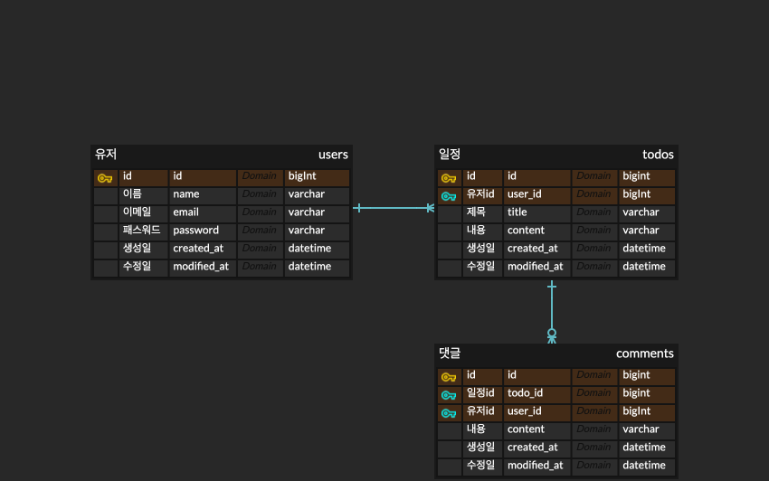

# Todo List

인프런 부트캠프(Spring 과정) 개인 과제로 구현한 일정 관리 프로젝트입니다.

## API 명세서

### User API

### 1. 사용자 생성

### Request
POST /users

### Request Body
```json
{
    "name": "홍길동",
    "email": "hong@test.com",
    "password": "password123"
}
```

### Response 200 OK
```json
{
    "id": 1,
    "name": "홍길동",
    "email": "hong@test.com",
    "createdAt": "2026-07-21T04:05:12.526616",
    "modifiedAt": "2026-07-21T04:05:12.526616"
}
```

### 2. 전체 사용자 조회

### Request
GET /users

### Response 200 OK
```json
[
    {
        "id": 1,
        "name": "홍길동",
        "email": "hong@test.com",
        "createdAt": "2026-07-21T04:05:12.526616",
        "modifiedAt": "2026-07-21T04:05:12.526616"
    }
]
```

### 3. 특정 사용자 조회

### Request
GET /users/{userId}

### Response 200 OK
```json
{
    "id": 1,
    "name": "홍길동",
    "email": "hong@test.com",
    "createdAt": "2026-07-21T04:05:12.526616",
    "modifiedAt": "2026-07-21T04:05:12.526616"
}
```

### 4. 사용자 수정

### Request
PUT /users/{userId}

### Request Body
```json
{
    "name": "홍길동수정",
    "email": "test2@gmail.com",
    "password": "23456789"
}
```

### Response 200 OK
```json
{
    "id": 1,
    "name": "홍길동수정",
    "email": "test2@gmail.com",
    "createdAt": "2026-07-21T04:05:12.526616",
    "modifiedAt": "2026-07-21T04:05:12.526616"
}
```

### 5. 사용자 삭제

### Request
DELETE /users/{userId}

### Response 200 OK
```json
```

### Todo API

### 1. 일정 생성

### Request
POST /users/{userId}/todos

### Request Body
```json
{
    "title": "공부하기",
    "contents": "Java 공부"
}
```

### Response 200 OK
```json
{
    "id": 1,
    "user": {
        "name": "홍길동",
        "email": "test@gmail.com",
        "password": "$2a$04$2Y.Ns1osue7LmqDIrKcxyuadM4rXWZz23D/lop29L2eLwhRqMTz4y",
        "createdAt": "2026-07-21T04:05:12.526616",
        "id": 1,
        "modifiedAt": "2026-07-21T04:13:49.417135"
    },
    "title": "공부하기",
    "content": "자바 공부",
    "createdAt": "2026-07-21T04:26:33.805624",
    "modifiedAt": "2026-07-21T04:26:33.805624"
}
```

### 2. 전체 일정 조회

### Request
GET users/{userId}/todos
GET users/{userId}/todos?page=0&size=5

### Response 200 OK
```json
{
    "content": [
        {
            "id": 1,
            "title": "공부하기",
            "content": "자바 공부",
            "commentCount": 0,
            "username": "홍길동",
            "createdAt": "2026-07-21T04:26:33.805624",
            "modifiedAt": "2026-07-21T04:26:33.805624"
        }
    ],
    "empty": false,
    "first": true,
    "last": true,
    "number": 0,
    "numberOfElements": 1,
    "pageable": {
        "offset": 0,
        "pageNumber": 0,
        "pageSize": 10,
        "paged": true,
        "sort": {
            "empty": true,
            "sorted": false,
            "unsorted": true
        },
        "unpaged": false
    },
    "size": 10,
    "sort": {
        "empty": true,
        "sorted": false,
        "unsorted": true
    },
    "totalElements": 1,
    "totalPages": 1
}
```

### 3. 특정 일정 조회

### Request
GET users/{userId}/todos/{todoId}

### Response 200 OK
```json
{
    "id": 1,
    "user": {
        "name": "홍길동",
        "email": "test@gmail.com",
        "password": "$2a$04$2Y.Ns1osue7LmqDIrKcxyuadM4rXWZz23D/lop29L2eLwhRqMTz4y",
        "createdAt": "2026-07-21T04:05:12.526616",
        "hibernateLazyInitializer": {},
        "id": 1,
        "modifiedAt": "2026-07-21T04:13:49.417135"
    },
    "title": "공부하기",
    "content": "자바 공부",
    "createdAt": "2026-07-21T04:26:33.805624",
    "modifiedAt": "2026-07-21T04:26:33.805624"
}
```

### 4. 일정 수정

### Request
PUT users/{userId}/todos/{todoId}

### Request Body
```json
{
    "title": "공부하기",
    "content": "JPA 공부"
}
```

### Response 200 OK
```json
{
    "id": 1,
    "user": {
        "name": "홍길동",
        "email": "test@gmail.com",
        "password": "$2a$04$2Y.Ns1osue7LmqDIrKcxyuadM4rXWZz23D/lop29L2eLwhRqMTz4y",
        "createdAt": "2026-07-21T04:05:12.526616",
        "hibernateLazyInitializer": {},
        "id": 1,
        "modifiedAt": "2026-07-21T04:13:49.417135"
    },
    "title": "공부하기",
    "content": "JPA 공부",
    "createdAt": "2026-07-21T04:26:33.805624",
    "modifiedAt": "2026-07-21T04:26:33.805624"
}
```

### 5. 일정 삭제

### Request
DELETE users/{userId}/todos/{todoId}

### Response 200 OK
```json
```

### Comment API

### 1. 댓글 생성

### Request
POST users/{userId}/todos/{todoId}/comments

### Request Body
```json
{
    "content": "화이팅입니다!"
}
```

### Response 200 OK
```json
{
    "id": 1,
    "content": "화이팅입니다!",
    "user": {
        "name": "홍길동",
        "email": "hong@test.com",
        "password": "$2a$04$T6Fem1vPSI17ZtHKmtrMn.RjTzKZWyiYYyHWtVkRgRYtyC3/kWye.",
        "createdAt": "2026-07-21T04:42:52.086787",
        "id": 1,
        "modifiedAt": "2026-07-21T04:42:52.086787"
    },
    "todo": {
        "user": {
            "name": "홍길동",
            "email": "hong@test.com",
            "password": "$2a$04$T6Fem1vPSI17ZtHKmtrMn.RjTzKZWyiYYyHWtVkRgRYtyC3/kWye.",
            "createdAt": "2026-07-21T04:42:52.086787",
            "id": 1,
            "modifiedAt": "2026-07-21T04:42:52.086787"
        },
        "title": "공부하기",
        "content": "자바 공부",
        "createdAt": "2026-07-21T04:42:55.397084",
        "id": 1,
        "modifiedAt": "2026-07-21T04:42:55.397084"
    },
    "createdAt": "2026-07-21T04:43:14.56336",
    "modifiedAt": "2026-07-21T04:43:14.56336"
}
```

### 2. 전체 댓글 조회

### Request
GET users/{userId}/todos/{todoId}/comments

### Response 200 OK
```json
[
    {
        "id": 1,
        "content": "화이팅입니다!",
        "user": {
            "name": "홍길동",
            "email": "hong@test.com",
            "password": "$2a$04$T6Fem1vPSI17ZtHKmtrMn.RjTzKZWyiYYyHWtVkRgRYtyC3/kWye.",
            "createdAt": "2026-07-21T04:42:52.086787",
            "hibernateLazyInitializer": {},
            "id": 1,
            "modifiedAt": "2026-07-21T04:42:52.086787"
        },
        "todo": {
            "user": {
                "name": "홍길동",
                "email": "hong@test.com",
                "password": "$2a$04$T6Fem1vPSI17ZtHKmtrMn.RjTzKZWyiYYyHWtVkRgRYtyC3/kWye.",
                "createdAt": "2026-07-21T04:42:52.086787",
                "hibernateLazyInitializer": {},
                "id": 1,
                "modifiedAt": "2026-07-21T04:42:52.086787"
            },
            "title": "공부하기",
            "content": "자바 공부",
            "createdAt": "2026-07-21T04:42:55.397084",
            "hibernateLazyInitializer": {},
            "id": 1,
            "modifiedAt": "2026-07-21T04:42:55.397084"
        },
        "createdAt": "2026-07-21T04:43:14.56336",
        "modifiedAt": "2026-07-21T04:43:14.56336"
    }
]
```

### 3. 특정 댓글 조회

### Request
GET users/{userId}/todos/{todoId}/comments/{commentId}

### Response 200 OK
```json
{
    "id": 1,
    "content": "화이팅입니다!",
    "user": {
        "name": "홍길동",
        "email": "hong@test.com",
        "password": "$2a$04$T6Fem1vPSI17ZtHKmtrMn.RjTzKZWyiYYyHWtVkRgRYtyC3/kWye.",
        "createdAt": "2026-07-21T04:42:52.086787",
        "hibernateLazyInitializer": {},
        "id": 1,
        "modifiedAt": "2026-07-21T04:42:52.086787"
    },
    "todo": {
        "user": {
            "name": "홍길동",
            "email": "hong@test.com",
            "password": "$2a$04$T6Fem1vPSI17ZtHKmtrMn.RjTzKZWyiYYyHWtVkRgRYtyC3/kWye.",
            "createdAt": "2026-07-21T04:42:52.086787",
            "hibernateLazyInitializer": {},
            "id": 1,
            "modifiedAt": "2026-07-21T04:42:52.086787"
        },
        "title": "공부하기",
        "content": "자바 공부",
        "createdAt": "2026-07-21T04:42:55.397084",
        "hibernateLazyInitializer": {},
        "id": 1,
        "modifiedAt": "2026-07-21T04:42:55.397084"
    },
    "createdAt": "2026-07-21T04:43:14.56336",
    "modifiedAt": "2026-07-21T04:43:14.56336"
}
```

### 4. 댓글 수정

### Request
PUT users/{userId}/todos/{todoId}/comments/{commentId}

### Request Body
```json
{
    "content": "열심히하세요!"
}
```

### Response 200 OK
```json
{
    "id": 1,
    "content": "열심히하세요!",
    "user": {
        "name": "홍길동",
        "email": "hong@test.com",
        "password": "$2a$04$T6Fem1vPSI17ZtHKmtrMn.RjTzKZWyiYYyHWtVkRgRYtyC3/kWye.",
        "createdAt": "2026-07-21T04:42:52.086787",
        "hibernateLazyInitializer": {},
        "id": 1,
        "modifiedAt": "2026-07-21T04:42:52.086787"
    },
    "todo": {
        "user": {
            "name": "홍길동",
            "email": "hong@test.com",
            "password": "$2a$04$T6Fem1vPSI17ZtHKmtrMn.RjTzKZWyiYYyHWtVkRgRYtyC3/kWye.",
            "createdAt": "2026-07-21T04:42:52.086787",
            "hibernateLazyInitializer": {},
            "id": 1,
            "modifiedAt": "2026-07-21T04:42:52.086787"
        },
        "title": "공부하기",
        "content": "자바 공부",
        "createdAt": "2026-07-21T04:42:55.397084",
        "hibernateLazyInitializer": {},
        "id": 1,
        "modifiedAt": "2026-07-21T04:42:55.397084"
    },
    "createdAt": "2026-07-21T04:43:14.56336",
    "modifiedAt": "2026-07-21T04:43:14.56336"
}
```

## 5. 댓글 삭제

### Request
DELETE users/{userId}/todos/{todoId}/comments/{commentId}

### Response 200 OK
```json
```

## ERD


